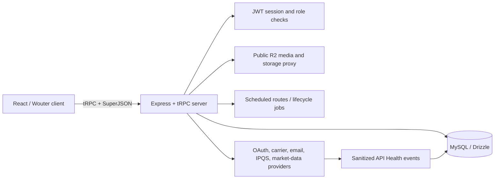

# Tradebilia Complete Codebase, Architecture, and End-to-End Audit

**Audit date:** 2026-08-21  
**Audit mode:** Read-only. No application code, database schema, API contract, live data, external-provider configuration, or user-visible behavior was changed.  
**Baseline reviewed:** Managed project version `14b96226`; full suite previously passed with **363 tests passing and 4 skipped** across 114 test files. TypeScript and the production build also passed.

## 1. Executive summary

Tradebilia has a substantial amount of real business logic and a stronger testing culture than a typical early marketplace application. The core trade-acceptance and counteroffer paths use database transactions and row locking; public profile privacy, inquiry-reply access, trade-complaint authorization, and private location masking have all been materially improved by the recent reliability work. The public pages sampled in desktop and mobile viewports load, have coherent visual identity, and provide useful loading or empty-state treatment.

The hard truth is that **the current risks are no longer cosmetic**. The highest-priority weaknesses are authorization and confidentiality gaps around provider account linking, pending-convention data, payment verification, and private report evidence. There are also concrete integrity defects in inquiry routing, referral delivery bookkeeping, forum locking, and valuation normalization. These should be addressed before a broad public launch.

| Severity | Confirmed findings | Launch implication |
|---|---:|---|
| Critical | 0 | No verified critical defect was found in the current source review. |
| High | 4 | Address before public launch; they affect private data, external-account linking, or financial-trade records. |
| Medium | 12 | Address in the next remediation release; they affect data integrity, resilience, valuation truthfulness, accessibility, or trust. |
| Low / architecture debt | 7 | Plan deliberately; these are scaling, usability, and maintainability concerns. |
| Refuted or already repaired | 8 | Do not spend development time re-fixing these without new evidence. |
| Unverified in read-only audit | 6 | Require controlled live, load, or provider testing rather than assumptions. |

> **Release posture:** Do not treat a passing unit suite as proof that the application is launch-ready. The existing suite is valuable but is predominantly source- and unit-oriented. It does not exercise cross-user authorization attacks, full browser workflows, live provider failures, concurrent database behavior, or storage-bucket policy end to end.

## Remediation update — 2026-08-21

The four highest-severity findings approved for immediate repair are complete. No database migration, seed operation, destructive script, or change to public listing/avatar media access was required.

| Audit ID | Completed repair | Validation |
|---|---|---|
| AUD-001 | The storage proxy now recognizes report-evidence paths and requires the reporting member or an administrator before requesting a presigned URL. Public media paths retain their existing behavior. | `storageProxy.test.ts` verifies path recognition and owner/admin/outsider decisions. |
| AUD-002 | eBay, Facebook, and LinkedIn linking now use a server-issued, HttpOnly, one-time state cookie with a 10-minute lifetime. Callbacks constant-time validate and clear the state before linking an account. | `providerOauthState.test.ts` verifies state generation, comparison, and provider isolation. |
| AUD-003 | Pending conventions are now a protected administrator-only query. | `highPriorityAccessControls.test.ts` verifies the procedure cannot regress to public access. |
| AUD-004 | Payment verification now loads the proposal and verifies that payer and payee are the two distinct participants before any PayPal lookup, activity write, or payment record mutation. | `paymentAuthorization.test.ts` and `highPriorityAccessControls.test.ts` verify participant and ordering safeguards. |

Focused high-severity coverage passed: **4 test files, 9 tests**. Deterministic application validation passed: **112 test files, 358 tests**, with four existing skips. TypeScript, production build, and whitespace validation passed. Five live credential probes (DHL, FedEx, UPS, USPS, and Twilio) could not complete because their external endpoints timed out from this environment; those are external-network validation gaps, not failures in the repaired code paths.

## Next-batch remediation update — 2026-08-21

The next approved integrity batch is complete without adding or expanding multi-factor authentication. Item inquiries now reject a caller-supplied recipient unless it matches the selected listing’s actual owner. Referral batches mark only confirmed successful sends as delivered. Forum replies now enforce a locked-post check at the write boundary.

Custom-auth tokens now carry a password-derived session version. Replacing a password through either normal account settings or recovery invalidates all prior custom-auth sessions at their next verification; this is session revocation, not a second authentication factor. Test AI metrics now exclude non-USD evidence until a vetted currency-conversion source is introduced and remove duplicate sale records before statistics or confidence are calculated. FedEx tracking failures now add sanitized API Health events without exposing a tracking number or credential.

Focused regression coverage passed with **4 files and 8 tests**, followed by successful TypeScript, production build, and whitespace checks.

## 2. Application architecture

## Lower-priority remediation update — 2026-08-21

Direct reinspection confirmed that owner-scoped listing photo removal, ordering, and cover-photo selection already exist in the active `updateListing` transaction: omitted retained URLs are deleted only for the owner’s listing and retained photo order persists through `sortOrder`. No duplicate backend change was made. The shared desktop and mobile search inputs now have explicit accessible labels.

The remaining lower-priority items are documented rather than auto-implemented: shared cache storage is deferred until multi-instance scaling; a review reveal deadline is a product policy; real-time trade updates are deferred until polling creates measurable friction; schema migrations remain reviewed release operations, not automatic deploy actions; and independent inquiry retention requires a deliberate per-participant deletion schema.

Tradebilia is a React 19 application built with Vite, Tailwind, TanStack React Query, Wouter, and tRPC. The Node/Express server exposes a tRPC API at `/api/trpc`, several Express routes for health, scheduled work, storage, and provider callbacks, and uses Drizzle/MySQL for persistence. Authentication is a signed JWT in an HttpOnly cookie with an Authorization-header fallback. The platform integrates Cloudflare R2/public media, private report-evidence storage, Resend, Twilio, IPQS, PayPal, eBay, Facebook, LinkedIn, carrier APIs, and several collectible-data services.

| Layer | Verified implementation | Principal responsibility |
|---|---|---|
| Client | `client/src/main.tsx`, `App.tsx`, `pages/`, `components/` | Routing, React Query caching, UI state, responsive marketplace and account experiences. |
| API | `server/routers.ts`, `tradeFlowRouter.ts`, `testAIRouter.ts` | tRPC business procedures with Zod schemas and role/participant checks. |
| Server runtime | `server/_core/index.ts`, `context.ts`, `trpc.ts` | Express registration, request context, JWT resolution, public/protected/admin procedure tiers. |
| Persistence | `drizzle/schema.ts`, `server/db.ts` | MySQL models, query helpers, transactions, marketplace and communication persistence. |
| Storage | `r2PublicMedia.ts`, `reportEvidence.ts`, `storageProxy.ts` | Public listing/avatar media and report-evidence references. |
| Operational services | `scheduledRoutes.ts`, `apiHealth.ts`, `preLaunchEmail.ts` | Health probes, lifecycle work, provider-failure telemetry, pre-launch mail. |

## 3. Codebase inventory and audit coverage

The reviewed source tree contains approximately **208 client TypeScript/TSX files**, **193 server TypeScript files**, **15 shared TypeScript files**, **2 Drizzle files**, and **118 test files**. The audit mapped route registration, public/protected/admin procedure boundaries, schema and helper layers, storage paths, external-adapter boundaries, scheduled routes, build scripts, and visible public UX.

| Area | Evidence reviewed | Status |
|---|---|---|
| Frontend routes and shared navigation | `client/src/App.tsx`, `TopBar.tsx`, `CategoryBar.tsx`, representative public pages | Mapped and visually sampled. |
| Authentication and authorization | `server/_core/customAuth.ts`, `context.ts`, `trpc.ts`, `routers.ts`, `tradeFlowRouter.ts` | Mapped; high-risk candidates directly checked. |
| Database and state transitions | `drizzle/schema.ts`, `server/db.ts`, trade and lifecycle modules | Mapped; transaction and integrity hotspots reviewed. |
| External integrations | OAuth, carrier, Resend, IPQS, market-data and Test AI modules | Mapped; source-level resilience reviewed. |
| Deployment and tests | `package.json`, Vite/esbuild configuration, Vitest suites, scheduled routes | Mapped; full prior validation result reviewed. |
| Full live/provider behavior | Production provider accounts, bucket policies, load, concurrent DB behavior | **UNVERIFIED — REQUIRES TESTING.** |

## 4. Confirmed high-priority findings

### AUD-001 — Private report evidence can be retrieved through an unauthenticated storage proxy

| Field | Detail |
|---|---|
| Severity | **HIGH** |
| Category | Security, privacy, file access |
| Location | `server/_core/storageProxy.ts`, `registerStorageProxy()`; report attachment paths are generated and validated in `server/reportEvidence.ts` and submitted through `server/routers.ts`. |
| Problem | `GET /manus-storage/*` obtains a presigned Forge URL for an arbitrary supplied key and redirects without a session, owner, report-participant, or administrator check. Report evidence is deliberately stored under `reports/{userId}/...`, but that path convention is not enforced by the proxy. |
| Why it matters | Possession or disclosure of an evidence URL/key is enough to bypass the intended private-evidence boundary. Evidence may contain screenshots, receipts, identities, or dispute details. |
| Reproduction | Request `/manus-storage/reports/{known-user-id}/{known-file}` directly. The server attempts to presign and redirects without authorization. |
| Recommended fix | Split public and private media access. Keep public listing/avatar media public; require an authenticated ownership or admin check before presigning any `reports/` key. Do not rely on path obscurity. |
| Confidence | **High — direct source verification.** |

### AUD-002 — Provider account-linking callbacks omit OAuth state validation

| Field | Detail |
|---|---|
| Severity | **HIGH** |
| Category | Security, OAuth CSRF |
| Location | `server/_core/providerOAuthCallbacks.ts`; provider URL helpers in `server/_core/ebay.ts`, `facebook.ts`, and `linkedin.ts`. |
| Problem | eBay, Facebook, and LinkedIn callback routes check a session and authorization code but do not validate a session-bound, one-time OAuth `state` value. |
| Why it matters | An attacker can attempt account-linking CSRF: cause a signed-in Tradebilia member to complete a callback for the attacker's provider account, producing an incorrect linked identity. |
| Reproduction | Initiate provider authorization under attacker control, then induce an authenticated Tradebilia user to visit the callback URL. Current callback code has no nonce comparison. |
| Recommended fix | Generate a high-entropy state value at linking start, store it in a secure short-lived cookie or server-side session record, include it in the provider authorization URL, then constant-time compare and consume it in the callback. |
| Confidence | **High — direct source verification.** |

### AUD-003 — Pending convention submissions are publicly queryable

| Field | Detail |
|---|---|
| Severity | **HIGH** |
| Category | Authorization, moderation privacy |
| Location | `server/routers.ts`, `conventions.pending`. |
| Problem | `conventions.pending` is a `publicProcedure` that returns pending convention records, while approve/reject/delete/scrape enforce administrator checks. |
| Why it matters | Unvetted submissions and submitter-associated data become visible before moderation. This defeats the intended moderation boundary. |
| Reproduction | Invoke the public tRPC procedure without a session. |
| Recommended fix | Convert it to an administrator-only procedure or add the same role check used by neighboring moderation actions. |
| Confidence | **High — direct source verification.** |

### AUD-004 — Payment verification does not bind the caller and payee to the trade proposal

| Field | Detail |
|---|---|
| Severity | **HIGH** |
| Category | Authorization, trade/payment integrity |
| Location | `server/routers.ts`, `payment.verifyPayment`. |
| Problem | The protected procedure accepts `proposalId`, `payeeUserId`, `transactionId`, and `amount`, then creates/updates payment and activity records without first proving that the caller and payee are the two participants in that proposal. |
| Why it matters | Any authenticated member could write payment-verification attempts and activity records onto an unrelated trade, corrupting trade history and creating support disputes. |
| Reproduction | Call the procedure using a known unrelated proposal ID and arbitrary valid user ID as payee. The current check is authentication only. |
| Recommended fix | Load the proposal first, require `ctx.user.id` to be requester or recipient, require `payeeUserId` to be the other participant, and reject inactive/non-payable states before calling PayPal or writing records. |
| Confidence | **High — direct source verification.** |

## 5. Confirmed medium-priority findings

| ID | Finding | Location | Why it matters | Recommended action | Confidence |
|---|---|---|---|---|---|
| AUD-005 | Inquiry creation accepts a recipient ID without proving that recipient owns the selected listing. | `server/db.ts`, `sendItemInquiry()`; `routers.ts`, `market.sendInquiry`. | A member can misroute a listing inquiry to an unrelated user, exposing listing context and enabling harassment/spam. | Derive the recipient from `listings.ownerId`, or compare it to input and reject mismatches. | High |
| AUD-006 | Password change/recovery does not revoke existing one-year JWTs. | `server/_core/customAuth.ts`; `routers.ts`, password recovery and `changePassword`. | A stolen or previously issued token remains usable after the owner changes a password. | Add a token/session version or password-changed timestamp validated on every session resolution. Requires a deliberate schema/session design. | High |
| AUD-007 | The unauthenticated health response returns raw database error text. | `server/scheduledRoutes.ts`, `makeHealthHandler()`. | It can disclose driver, host, timeout, or topology details during an outage. | Log detailed errors server-side; return only generic public health state. | High |
| AUD-008 | No application-wide rate limiter protects public tRPC and sensitive account endpoints. | `server/_core/index.ts`; recovery has a local limiter but sign-in, signup, subscriptions, and other public procedures lack a shared gateway limiter. | Credential stuffing, signup abuse, scrape pressure, and resource exhaustion remain possible. | Add route-aware IP and account-identifier limits with safe proxy/IP handling and tests. | High |
| AUD-009 | Referral batch bookkeeping marks every attempted referral as emailed, even when an individual send fails. | `server/routers.ts`, referral send loop; `server/db.ts`, `markReferralsAsEmailed()`. | Failed invites may never be retried because they are recorded as sent. | Collect only successful IDs, mark those, and surface/send failures for retry. | High |
| AUD-010 | Locked forum posts do not block reply insertion. | `server/db.ts`, `addForumReply()`. | Moderators cannot reliably close a discussion; direct calls can append replies to locked threads. | Load and reject locked posts inside the same write path, ideally transactionally. | High |
| AUD-011 | Listing owners cannot delete their own existing photos during edit; photo replacement is administrator-only. | `server/db.ts`, `updateListing()`. | Members cannot promptly remove wrong, sensitive, or obsolete active-listing images. | Permit owner-scoped individual photo deletion/reordering with the existing ownership check. | High |
| AUD-012 | Test AI valuation metrics aggregate numeric prices without currency normalization. | `server/testAIRouter.ts`, `computeMetrics()`. | A USD/EUR/GBP mix produces mathematically valid but economically false averages, medians, and confidence. | Require source currency, normalize to declared base currency with dated FX, or exclude unsupported currencies. | High |
| AUD-013 | Test AI does not deduplicate overlapping completed-sale evidence before metrics. | `server/testAIRouter.ts`, `computeMetrics()`; market acquisition aggregation. | Duplicate cross-provider or overlapping pagination results inflate sample size and bias valuation. | Deduplicate by source sale ID/URL first, with a conservative title-date-price fingerprint fallback. | High |
| AUD-014 | eBay refresh-token helper exists but has no verified production call path. | `server/_core/ebay.ts`, `refreshAccessToken()`; no invocation found in current routes/jobs. | Linked eBay functionality can fail after access-token expiry until a user reconnects. | Refresh on demand before eBay calls or use a secure renewal job; persist the new encrypted token and expiry. | High |
| AUD-015 | Carrier and OAuth failures are not consistently recorded in API Health; carrier/OAuth calls are one attempt only. | Carrier tracking modules and provider adapters; `apiHealth.ts` is used by only selected integrations. | Operational failures can be invisible, and transient provider errors become immediate user failures. | Apply one shared bounded timeout/retry/telemetry wrapper; retry only idempotent reads and token-safe calls. | High |
| AUD-016 | Base64 image uploads travel inside tRPC JSON payloads. | `AddInventory.tsx`, media schemas, server upload helpers. | Multiple large mobile images increase request memory, latency, and timeout risk even with size ceilings. | Move to direct, signed multipart/resumable uploads and submit only media metadata in tRPC. | High |
| AUD-017 | TopBar mounts `SignInModal` twice for unauthenticated desktop rendering; search inputs lack accessible labels. | `client/src/components/TopBar.tsx`. | Duplicate modal portals can cause focus/state conflicts; unlabeled controls reduce assistive-technology usability. | Remove the duplicate modal mount and add an explicit label or `aria-label` to each search input. | High |

## 6. Low-priority findings and technical debt

| ID | Finding | Assessment and recommendation |
|---|---|---|
| AUD-018 | `CountrySelect` is a custom dropdown without complete combobox/listbox semantics or arrow-key support. | Use the existing accessible primitives or implement WAI-ARIA keyboard behavior. |
| AUD-019 | Selecting a listing cover photo uses a non-semantic clickable element. | Replace it with a descriptive button; this is an easy accessibility repair. |
| AUD-020 | The in-memory market-data cache is per-process and lost across restart/scale-out. | Fine for small single-instance use; use shared cache storage before horizontal scaling. |
| AUD-021 | Deployment relies on a manual migration discipline. | Do **not** auto-run migrations blindly against the production database. Instead require CI schema-drift checks, reviewed migration artifacts, backups, and a separate release step. |
| AUD-022 | Review visibility remains blind indefinitely if one trade participant never submits. | Product decision: introduce a stated reveal deadline if the platform wants reviews to be useful in abandoned relationships. |
| AUD-023 | Trade updates rely on polling rather than a push channel. | Not an integrity defect; consider SSE/WebSockets when active negotiation volume justifies it. |
| AUD-024 | Existing inquiry deletion uses one shared `deletedAt` state. | A participant can affect the other party's history visibility. This is a valid data-model decision previously deferred; use `senderDeletedAt` and `recipientDeletedAt` if independent retention is desired. |

## 7. Findings explicitly refuted or already repaired

The following candidates were checked and should **not** be treated as current defects without new evidence.

| Candidate | Current result | Evidence |
|---|---|---|
| Public profiles expose account email or raw activity timestamps. | **Refuted.** | Public profile projection excludes private email fields and returns server-computed online state. |
| Inquiry replies, trade complaints, counterpart inventory, middleman actions, and voting links allow arbitrary outsiders. | **Refuted.** | Recent participant checks are present and covered by second-/third-pass regression suites. |
| eBay access and refresh tokens are stored plaintext. | **Refuted.** | `server/db.ts`, `updateUserEbayInfo()` encrypts both values using `encrypt()` before persistence. |
| Draft edits erase every prior photo. | **Refuted.** | `server/db.ts`, `updateDraft()` compares existing image URLs against retained URLs and deletes only omitted assets. |
| Marketplace/member discovery returns exact private coordinates or street addresses. | **Refuted.** | Query models strip private location before return and expose coarse distance bands only. |
| Carrier tracking accepts unvalidated arbitrary tracking strings. | **Refuted.** | Carrier-specific normalization and format validation are present before requests. |
| Current full test suite requires missing provider credentials to pass. | **Refuted.** | The audited baseline full suite passed in the configured environment. |
| OAuth token exchange errors automatically reveal active access tokens in logs. | **Refuted for observed paths.** | Persistence encrypts tokens; observed failures are error responses, not successful token payloads. Continue log-scrubbing review for future providers. |

## 8. Security audit summary

The application has real protective controls: Zod input validation is broadly used, Drizzle parameterization avoids the observed SQL-injection patterns, cookies are HttpOnly with secure handling, core Manus OAuth has state validation, report attachment keys are validated before persistence, and recent participant authorization repairs are effective. The gap is inconsistent application of those controls at **integration boundaries**.

The immediate security sequence is straightforward: protect private storage, add provider-linking OAuth state, close public pending-convention access, bind payment verification to trade participants, enforce inquiry ownership, sanitize health errors, and add abuse throttling. Do not prioritize speculative redesigns ahead of these directly verified access controls.

## 9. Database and workflow audit summary

Trade acceptance and counteroffer replacement use transactions and row locks, and unique indexes protect several junction tables. Those are meaningful controls. However, there are still application-level integrity rules that must be enforced at the write boundary: inquiry recipient ownership, forum lock status, successful-only referral send bookkeeping, and independent deletion semantics if the product requires each participant to retain their own communication history.

The current draft-photo relation remains a known schema coupling: draft photos reuse a table whose declared foreign key refers to active listings. This is not a new production failure in this audit because recent cleanup was made transactional, but it is still a schema redesign candidate. It should be migrated only through a reviewed, non-destructive plan.

## 10. API and external-integration audit summary

| Integration area | Verified position | Principal follow-up |
|---|---|---|
| OAuth | Token encryption is present; provider-linking CSRF state is missing; eBay renewal path is not wired. | Fix state validation and refresh lifecycle. |
| Carriers | Input normalization and request timeouts are present. | Add bounded retry only for safe reads and API Health telemetry. |
| Resend/referrals | Pre-launch failure instrumentation exists. | Correct referral success bookkeeping and define retry policy. |
| IPQS | Signup approval workflow and failure handling exist. | Validate live rate/timeout behavior under controlled test. |
| Market/Test AI | Outlier filtering and historical-context guardrails exist. | Normalize currency and deduplicate evidence before displaying valuation metrics. |
| API Health | Sanitization/classification exists. | Expand adoption to carriers, OAuth, and other provider adapters. |

## 11. Collectible data and valuation audit

Tradebilia correctly distinguishes several types of evidence: current market, completed sales, historical records, certification, and reference metadata. It also flags identity discrepancies and uses an IQR outlier filter. Those safeguards are useful but incomplete.

The valuation pipeline cannot truthfully aggregate values unless every price is in one stated currency and duplicate sales are removed first. Until those two controls exist, any Test AI aggregate should be labeled **informational evidence, not a definitive valuation**. The system should expose source, sale date, currency, sale-versus-asking status, matching confidence, and excluded data to the user before presenting a market summary.

## 12. Frontend, accessibility, and UX audit

Representative public pages were visually sampled on desktop and mobile: home, global search, Comics category, member directory, public profile, Coming Soon, and password recovery. All sampled pages rendered without an obvious route crash. Mobile category cards, directory cards, Coming Soon, and password recovery remained usable in the sampled viewport.

The larger UX gap is testing rather than broad visual breakage. There is no verified browser E2E suite, automated accessibility scanner, visual regression suite, or concurrent-user workflow test. Accessibility defects found directly include duplicated sign-in modal mounting, unlabeled global search fields, the custom country picker, and the non-semantic photo-cover action.

## 13. Performance, deployment, and test coverage

The previous production build succeeded but emitted a large client-chunk advisory. The current bundle has a large initial JavaScript asset and uses polling in active trade workflows. Neither is a launch blocker by itself, but both deserve measurement before scale. Market data cache is in-memory, so it will not share state between multiple instances.

The production database must not be altered by an automatic migration runner. The correct deployment improvement is controlled release discipline: reviewed migration SQL, a backup/rollback plan, environment parity checks, and a CI gate that rejects code/schema drift. The no-migration constraint for this audit was respected.

| Coverage area | Current position | Required next validation |
|---|---|---|
| Unit/regression | Strong and recently passing. | Maintain and add tests for every confirmed repair. |
| Browser E2E | Missing. | Add two-account flows for signup, listing, inquiry, trade, shipment, dispute, and review. |
| Authorization adversarial | Partial static coverage. | Test wrong-user IDs and direct tRPC requests for every mutation namespace. |
| Accessibility | No automated scan observed. | Add axe-based CI checks and keyboard/focus tests. |
| Load/concurrency | No production-like validation observed. | Test trade acceptance, counteroffers, search, image uploads, and provider degradation. |
| Provider/live validation | Credentials exist, but end-to-end status is not provable from source. | Execute controlled read-only provider probes and expiry/failure simulations. |

## 14. Unverified items requiring controlled testing

| Area | Why source review is insufficient | Required test |
|---|---|---|
| R2/private-storage policy | Source cannot prove bucket IAM, CORS, CDN, or revoked-URL behavior. | Use a non-sensitive test attachment and two authenticated identities plus unauthenticated request. |
| OAuth flows | Provider consent, redirect registration, token expiration, and revocation are external. | Run controlled eBay/Facebook/LinkedIn linking and failure tests after state repair. |
| Database concurrency | Static locks exist; production isolation, timeouts, and indices are environment-specific. | Run isolated concurrent acceptance/counteroffer/load tests. |
| Provider resilience | Live rate limits, malformed payloads, and service outages are not source facts. | Use provider sandboxes/mocks and API Health assertions. |
| Browser workflows | Component source cannot prove all focus, modal, network-loss, refresh, and double-submit behavior. | Add Playwright-style two-user regression flows. |
| Performance | Real data size and instance topology are unknown. | Establish page/API budgets and run load profiling before launch. |

## 15. Prioritized remediation plan

| Priority | Issue | Area | Severity | Recommended action |
|---:|---|---|---|---|
| 1 | AUD-001 private report storage proxy | Security | High | Authorize private keys before presigning; separate public/private access. |
| 2 | AUD-002 provider OAuth CSRF | Security | High | Add one-time, session-bound state validation to all account-link callbacks. |
| 3 | AUD-004 payment verification IDOR | Trade/payment | High | Require proposal participant and payee-counterparty validation before any write. |
| 4 | AUD-003 pending conventions exposure | Moderation | High | Make pending moderation data admin-only. |
| 5 | AUD-005 inquiry recipient mismatch | Messaging | Medium | Derive recipient from listing owner. |
| 6 | AUD-006 session revocation | Authentication | Medium | Approve and implement session-versioned tokens. |
| 7 | AUD-008 global throttling | Abuse resistance | Medium | Add gateway controls to sensitive/public routes. |
| 8 | AUD-012 multi-currency valuation | Valuation | Medium | Normalize/exclude before metrics. |
| 9 | AUD-013 duplicate sales | Valuation | Medium | Deduplicate before summary metrics. |
| 10 | AUD-014 eBay refresh lifecycle | Integration | Medium | Refresh safely before expiry and update encrypted credentials. |
| 11 | AUD-009 referral bookkeeping | Email integrity | Medium | Mark only confirmed successful deliveries. |
| 12 | AUD-010 forum locks | Moderation | Medium | Enforce `isLocked` at reply write time. |
| 13 | AUD-015 telemetry/retries | Operations | Medium | Centralize safe retry/telemetry wrapper. |
| 14 | AUD-007 health error leakage | Security | Medium | Return generic public outage status. |
| 15 | AUD-011 owner photo deletion | Marketplace UX | Medium | Allow owner-scoped deletion/reordering. |
| 16 | AUD-016 base64 uploads | Reliability | Medium | Move to signed uploads. |
| 17 | AUD-017 TopBar duplicate/a11y | UX/accessibility | Medium | Remove duplicate modal; label search fields. |
| 18 | AUD-018 Country picker and photo action | Accessibility | Low | Use semantic/keyboard-accessible controls. |
| 19 | AUD-021 migration governance | Deployment | Low | Add CI drift and release checks, not auto-migration. |
| 20 | E2E/a11y/load coverage gap | QA | Medium | Build a launch-gate validation suite. |

## 16. Top 20 things I would fix before launch

1. Prevent unauthenticated access to private report evidence.
2. Add OAuth state validation to provider account linking.
3. Bind payment verification to the actual two trade participants.
4. Lock down pending convention submissions to administrators.
5. Make the listing owner the sole valid recipient for an item inquiry.
6. Define and implement full session revocation after password reset/change.
7. Add global rate limiting and abuse telemetry for public/sensitive operations.
8. Normalize currency before every valuation metric.
9. Deduplicate sale evidence before it affects counts or prices.
10. Wire eBay refresh-token lifecycle safely.
11. Stop marking failed referral emails as delivered.
12. Enforce forum locks in the reply write path.
13. Record carrier/OAuth failures in API Health and use bounded safe retries.
14. Remove raw database error text from public health responses.
15. Let owners delete and reorder their own listing photos.
16. Replace base64 image transport with signed/resumable uploads.
17. Remove duplicate sign-in modal mounting and label search controls.
18. Add keyboard semantics to the country picker and photo-cover action.
19. Establish a reviewed migration, backup, and rollback release gate.
20. Add two-user browser E2E, accessibility, and concurrent-load tests as launch criteria.

## 17. Final conclusion

The platform is not a prototype with empty plumbing. It has real category data, trade state logic, account gating, provider modules, and a substantial test suite. But it is **not ready to rely on for a public marketplace launch until the confirmed authorization, privacy, and valuation defects are repaired and tested**. The priority order above is intentionally strict: secure private data and ownership boundaries first; make valuation truthful second; then harden operational resiliency and browser-level quality.

This audit is complete in read-only mode. Implementation should begin only after explicit approval of the prioritized remediation scope, especially for the schema-dependent session, draft-photo, and per-user inquiry-retention decisions.

## Source references

The report is grounded in the current project source and test suites, principally: [`server/routers.ts`](./server/routers.ts), [`server/db.ts`](./server/db.ts), [`server/tradeFlowRouter.ts`](./server/tradeFlowRouter.ts), [`server/_core/providerOAuthCallbacks.ts`](./server/_core/providerOAuthCallbacks.ts), [`server/_core/storageProxy.ts`](./server/_core/storageProxy.ts), [`server/scheduledRoutes.ts`](./server/scheduledRoutes.ts), [`server/testAIRouter.ts`](./server/testAIRouter.ts), [`drizzle/schema.ts`](./drizzle/schema.ts), and the relevant Vitest files under [`server/`](./server/).
