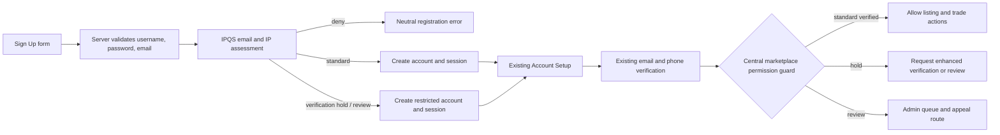

# IPQS Implementation Blueprint for Tradebilia

**Status:** Design only. No IPQS calls, schema changes, or onboarding behavior changes are included in this document.

## The Short Version

IPQS should run **only on the server**, immediately before a new account is created. Tradebilia should use the result to select one of three states: **standard**, **verification hold**, or **manual review**. A user should never see an IPQS score or be told which signal triggered a restriction.

The existing Tradebilia flow already creates a session at sign-up, then requires Account Setup with verified email and phone before setup finishes. IPQS should extend that model with a server-enforced marketplace permission check, not a separate or client-only form.



## How It Fits the Existing Code

| Existing component | Current responsibility | IPQS addition |
|---|---|---|
| `client/src/pages/SignUp.tsx` | Collects username, display name, email, and password; submits `auth.signup` | No API key, score, or fraud logic in the browser. At most, it renders a neutral server response such as “We could not complete registration. Please contact support.” |
| `server/routers.ts` → `auth.signup` | Validates inputs, creates the user/session, and returns the new user ID | Call a server-only `evaluateRegistrationRisk` before `createUser`. |
| `server/routers.ts` → email/phone code procedures | Performs existing trusted email-code and SMS-code checks | Keep these as primary ownership checks. They are not replaced by IPQS. |
| `server/routers.ts` → `profile.save` / Account Setup | Requires verified contacts and accepted terms before first-time setup persists | Preserve this; add a separate risk-state check after the existing verified-account requirements pass. |
| Listing and trade mutation entry points | Enforce action-specific business rules | Call one shared `requireMarketplacePermission(userId, action)` helper before creating a listing or initiating/countering a trade. |

## Server-Side Components to Add

| Component | Proposed responsibility | Data sent or stored |
|---|---|---|
| `server/integrations/ipqs.ts` | Makes authenticated server-to-server requests to IPQS Email and IP endpoints; applies timeouts; returns a minimal typed result | Sends normalized email and request IP/user agent only; API key remains in server environment variables |
| `server/accountRisk.ts` | Converts raw IPQS data into stable Tradebilia policy decisions | Uses only selected fields and reason codes; never returns raw vendor payload to the browser |
| `server/marketplacePermissions.ts` | Centralizes whether an account may list, initiate a trade, or send high-volume messages | Reads verified-contact status plus internal risk state |
| `server/routers/adminRisk.ts` | Provides an admin-only review queue and resolution controls | Shows minimum necessary reason labels and an audit trail |
| `server/ipqsRegistrationRisk.test.ts` | Covers decision boundaries, vendor timeout behavior, and permission enforcement | Uses fixtures; never calls IPQS with real user data during tests |

The secret would be added only when implementation is approved, using `IPQS_API_KEY` through the secure project secret setting. It must never be placed in React code, a URL, logs, test fixtures, or GitHub.

## Decision Model

The vendor response should be translated into a small internal contract. No UI should display an external numerical score.

```ts
type RegistrationRiskDecision = {
  tier: "standard" | "verification_hold" | "manual_review" | "deny";
  reasons: Array<
    | "email_invalid"
    | "email_disposable"
    | "email_recent_abuse"
    | "email_high_risk"
    | "email_new_with_other_risk"
    | "ip_confirmed_bot"
    | "ip_recent_abuse"
    | "ip_high_risk"
    | "vendor_unavailable"
  >;
  expiresAt: Date;
};
```

### Initial policy

| Tier | Conditions | Result |
|---|---|---|
| **Deny** | Invalid/disposable email, spam trap/honeypot, confirmed recent email abuse, or clear bot/abuse combination | Do not create an account. Return a neutral message and rate-limit repeats. |
| **Manual review** | Very high score plus multiple corroborating signals, confirmed automated traffic, or internally confirmed prior abuse | Create no active marketplace account, or create a restricted review record only if an appeal path is required. |
| **Verification hold** | New email combined with another adverse signal, suspicious email/IP reputation, or vendor result requiring follow-up | Account may enter Account Setup but cannot list, initiate a trade, or send high-volume messages until the existing contact verification and a review/hold release are complete. |
| **Standard** | Valid, non-disposable email with no material adverse signals | Normal registration and existing Account Setup flow. |

**Email age rule:** `first_seen` younger than one year is never sufficient by itself for a hold or denial. It becomes relevant only in combination with a second risk signal. This protects legitimate collectors using a newly created or changed email address.

**VPN rule:** A VPN/proxy flag is never sufficient by itself to deny an account. It may contribute to a hold only when paired with bot, recent-abuse, or other independently adverse signals.

## Minimal Data Model

After approval, add a small risk-assessment table through the existing schema-first migration process. Do not overload the `users` table with raw third-party data.

| Field | Purpose | Retention recommendation |
|---|---|---|
| `id`, `userId` (nullable before account creation), `createdAt`, `expiresAt` | Auditability and ownership | 90 days for routine checks |
| `source` | `ipqs_registration_v1` | 90 days |
| `tier` | Internal decision state | Account lifetime only while restriction is active |
| `reasonCodes` | Selected internal labels, not raw vendor payload | 90 days; longer only for confirmed abuse cases |
| `vendorRequestId` | Support/debug correlation without storing a full response | 90 days |
| `reviewedAt`, `reviewedBy`, `resolution` | Admin accountability and appeal history | Case-based retention policy |

Do **not** store raw device characteristics, exact location coordinates, identity-enrichment data, associated names/phones, or full IPQS JSON in the first release.

## Permission Enforcement

The important rule is that restrictions must be enforced by server mutations, not hidden buttons.

```ts
async function requireMarketplacePermission(userId: number, action: "list" | "trade" | "high_volume_message") {
  const profile = await getVerificationAndTermsStatus(userId);
  if (!profile.emailVerified || !profile.phoneVerified || !profile.acceptedTerms) {
    throw new TRPCError({
      code: "FORBIDDEN",
      message: "Complete account verification before using this marketplace feature.",
    });
  }

  const risk = await getActiveRiskDecision(userId);
  if (risk?.tier === "verification_hold") {
    throw new TRPCError({
      code: "FORBIDDEN",
      message: "Your account needs an additional verification step before using this marketplace feature.",
    });
  }
  if (risk?.tier === "manual_review") {
    throw new TRPCError({
      code: "FORBIDDEN",
      message: "Your account is being reviewed. Please contact support if you need help.",
    });
  }
}
```

This helper belongs in the server layer and should be used by every applicable listing and trade mutation. Client pages may render explanatory status, but they are never authoritative.

## Registration Request Sequence

1. The Sign Up page sends the current four fields to `auth.signup` over tRPC.
2. The server validates username/password/email locally and checks internal rate limits and username uniqueness.
3. The server normalizes the email and collects the request IP and user agent from the trusted request context.
4. `evaluateRegistrationRisk` calls IPQS Email Verification and IP Reputation with short timeouts and no client exposure of the key.
5. The server maps the response to the internal decision contract above.
6. If denied, the server returns a neutral rejection with rate limiting. It does not expose the IPQS score or reason.
7. If standard or verification-hold, the server creates the user, stores only the minimal decision record, creates the existing session, and routes to Account Setup.
8. The user completes the current email code, phone code, terms, and profile steps.
9. Listing/trade/server-side permission checks enforce the final state. Admins can clear a hold with an auditable reason.

## Vendor Failure Policy

IPQS availability must not create a fragile signup system.

| Situation | Initial behavior |
|---|---|
| IPQS timeout or 5xx response | Fail open into **temporary verification hold**, not permanent denial; record `vendor_unavailable`; require normal email/phone verification; retry only under a controlled background or later sensitive action process after separate approval. |
| Rate-limit/credit exhaustion response | Same temporary hold; alert admin; do not loop or retry synchronously. |
| Malformed response | Treat as vendor unavailable; log a redacted structured error only. |
| IPQS check succeeds but returns limited/tier-unavailable fields | Evaluate only available fields; never infer missing fields are benign. |

The registration endpoint needs a short timeout budget. A fraud lookup should not leave a user watching an indefinite “Creating Account…” state.

## Rollout Plan

| Phase | Production behavior | Measure before proceeding |
|---|---|---|
| **0. Vendor readiness** | Obtain an IPQS test/sandbox method, confirm fields on the current plan, approve privacy text and retention | Test fixtures, latency, cost per call, DPA fit |
| **1. Shadow mode** | Call server-side IPQS in the background but do not restrict accounts for 30 days | Distribution of risk tiers, signup completion, false-positive candidates, later abuse reports |
| **2. Objective blocks** | Block only invalid/disposable/honeypot/recent-abuse cases | Appeals, support load, prevented spam/fake accounts |
| **3. Verification holds** | Add holds for corroborated risk combinations; existing email/phone verification remains mandatory | Listing/trade fraud, completion rate, review turnaround |
| **4. IP and velocity** | Introduce server-side IP/bot checks at signup and sensitive actions | Bot/abuse reduction without excessive VPN/mobile false positives |
| **5. Device fingerprinting** | Consider only after a privacy-impact review and an explicit website notice update | Duplicate-account detection value versus user impact |

## Tests Required Before Release

| Test class | Required assertion |
|---|---|
| Unit: policy matrix | New email alone does not block; disposable/recent abuse does; VPN alone does not block; corroborated high risk holds or reviews. |
| Unit: vendor client | API key never reaches response/logs; timeout/malformed response becomes a safe temporary hold. |
| Integration: signup | Deny does not create a user/session; hold creates the correct restricted state; standard preserves the existing signup/session path. |
| Integration: permissions | A held account cannot create a listing or initiate/counter a trade, even if it calls a mutation directly. |
| Admin review | Only admins can resolve a hold; each resolution has actor, timestamp, and reason. |
| Browser | Standard signup still transitions into Account Setup with visible, neutral explanations. |

## Required Decisions Before Coding

1. Approve the **non-negotiable policy**: no one-year email-age hard block, no VPN-only ban, and no raw-score display.
2. Confirm which IPQS plan features are available, especially `first_seen`, email/IP `recent_abuse`, user activity, and request limits.
3. Choose the first marketplace actions to gate. Recommended initial actions are **create listing**, **initiate trade**, and **counter a trade**.
4. Define who reviews a held account, target turnaround time, and the simple support/appeal path.
5. Approve the privacy-notice update before any real email/IP information is sent to IPQS.

## Recommendation

Implement the **email and IP checks in shadow mode first**, then enable only objective blocks. Do not begin with device fingerprinting or identity-enrichment data. Tradebilia already has valuable foundations—email-code verification, SMS verification, account setup, and server-side privileged actions. IPQS should add a measured risk layer around those controls, not replace them.
